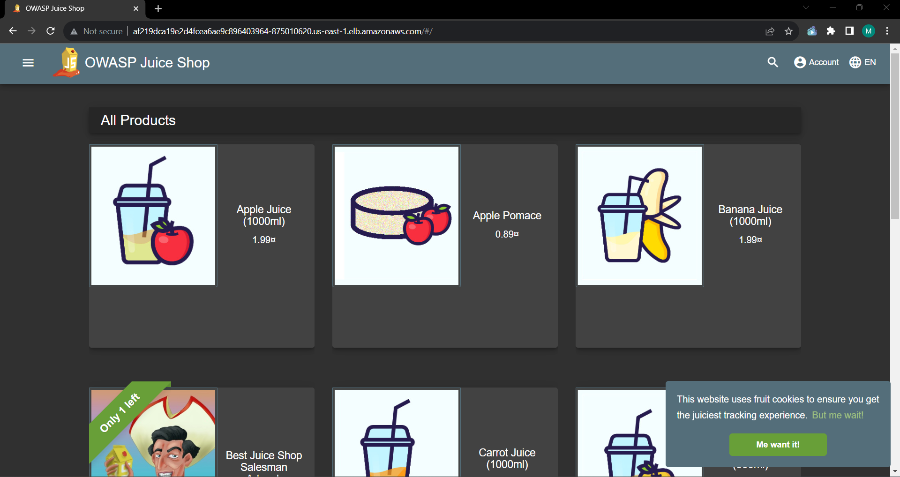
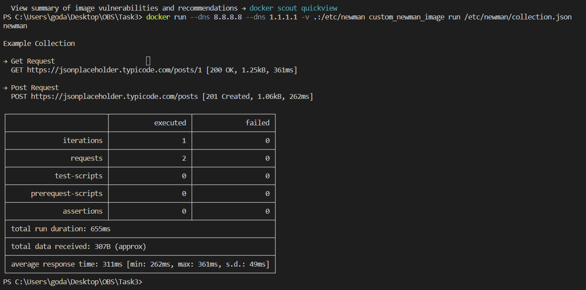

# 📋Task 1

This Python script performs several operations on a list of user data. Here's a brief overview of what the script does:

1. It defines two functions: is_valid_email(email) and process_user_data(name, email, id).

2. It creates a list called users containing tuples with user data.

3. It writes the user data to a file named input.txt.

4. It reads the data from input.txt, processes it, and provides feedback based on the results.

## 🚀How to Run the Script

1. Ensure Python is Installed:

 - Make sure you have Python installed on your system. If not, you can download it from Python's official website.

2. Save the Script:

- Save the provided script in a Python file, for example, user_data_processor.py.

3. Run the Script:

- Open a terminal or command prompt and navigate to the directory containing the script. Then, use the following command to run it:

```bash
python3 FQDN.py
```
This command executes the Python script.

4. Interpret the Output:

- The script will process the user data and provide feedback based on the results. The output will be displayed in the terminal.

#
# 📋Task 2
🏗️✨ An infrastructure has been meticulously crafted using Terraform to establish an Amazon Elastic Kubernetes Service (EKS) cluster. Following the setup, the delectable Juice Shop application was elegantly deployed within this environment. 🚀🌐

## 🚀How to Run it ?

1. Clone task2 then upload it in a separate repository.
2. Copy your AWS credentials then add to your secrets.
```
AWS_ACCESS_KEY_ID
AWS_SECRET_KEY_ID
AWS_REGION
```
3. Then push to your main branch.

4. After pushing update the kubeconfig by running the following:
```
aws eks update-kubeconfig --name hr-stag-eksdemo1 --region us-east-1
```

5. Then run the following kubectl command to get ingress URL to be able to browse the application.
```
kubectl get ingress
```


#
# 📋Task 3

## Dockerfile for Running Postman Collection with Newman.
This Dockerfile provides an environment for running Postman collections using Newman, with additional features and configurations.

## Base Image
This Dockerfile is based on the postman/newman:5.3.1-alpine image, providing a minimal Alpine Linux environment with Newman pre-installed.

## Updates and Installs

1. The apk update && apk upgrade command ensures that the system packages are up to date.

2. The npm install -g newman-reporter-csvallinone command globally installs the newman-reporter-csvallinone Node module for generating CSV reports.

3. Extra packages (curl, zip, iputils) are installed using apk add --no-cache to enhance functionality

## Environment Variables
NODE_PATH is set to /usr/local/lib/node_modules to specify the global module path.

## Entry Point
The entry point is configured to run the newman command, making it the default action when the container starts.

## Usage
To build an image from this Dockerfile, use the following command:
```
docker build -t custom_newman_image .
```
To run a Postman collection with Newman, mount your collection files into the /etc/newman directory:
```
docker run --dns 8.8.8.8 --dns 1.1.1.1 -v .:/etc/newman custom_newman_image run /etc/newman/collection.json
```
## Expected Output




